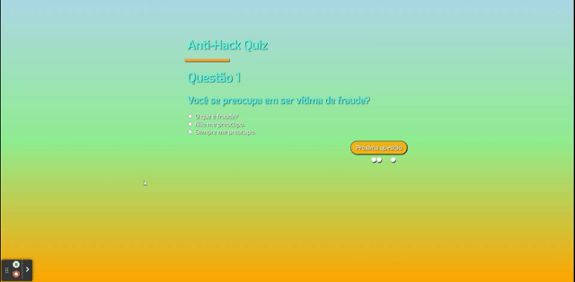

# Anti-Hack Quiz

Deploy: (EM BREVE)

Youtube: https://youtu.be/8SuOL734NSs

## Sobre

É um quiz com tema de segurança anti-hack, para que não se corra o risco de ter a sua senha roubada na internet.

### Objetivos

Aprender com funciona a criação de um Quiz usando Javascript. Criar uma experiência para o usuário mais dinâmica, oferecendo uns score ao final do quiz.

### Desafio

Conhecer como é feito um questionário usando o Javascript. Estou aprendendo através de uma aula no Youtube, em breve irei postar aqui dando os créditos.

### Conclusão

Finalizei mais este projeto com bom aproveitamento. Aprendi novos comandos em JS, assim como consegui compreender como funciona um Quiz usando o JS. O vídeo utlizado foi do Canal Feature Code no Youtube (https://youtu.be/XnH56whHQqw?si=oh6NEu5B1phD6yeR), possui uma exclente didática, recomendo bastante esta aula e principalmente o canal.

### Ferramentas Utilizadas

- HTML
- CSS
- Javascript
